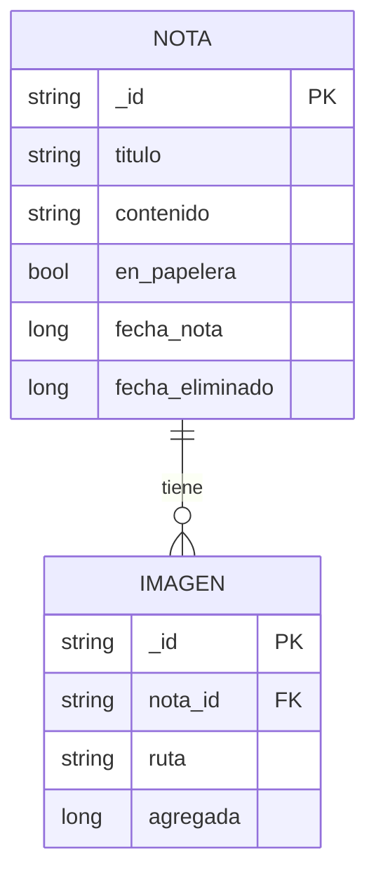

# GestorNotas

Este proyecto es una Aplicación Android para llevar un diario: hay notas con texto y fotos, papelera con caducidad y una interfaz responsiva y adaptable, modo claro y oscuro (Material Theme Builder con 6 esquemas!).

---
Acrividad 4 de la materia **Desarrollo de Aplicaciones Móviles**.

> *Equipo 1 - Sr Lucxs Studio*
 - DHH 2989955 [@CikiUmi](https://github.com/CikiUmi)
 - MHQ 3001084 [@WahWau](https://github.com/WahWau)
 - JMDR 7090780 [@SrLucas-tecx](https://github.com/SrLucas-tecx)

Las apps de notas suelen pedir una cuenta, sincronizar a un servidor y tratar cada
nota como un pendiente con fecha límite. Un diario no funciona así: la fecha no se
escoge, es cuándo lo escribiste, y lo que se guarda no tiene por qué salir del
teléfono. GestorNotas se queda con su propia copia de cada foto que adjuntas, así
que una entrada no se rompe si después limpias tu galería.

---

## Funciones principales

- **Escribir.** Una nota es un título y un cuerpo. Leer y editar son la misma
  pantalla. El botón de acción cambia de lápiz a palomita según el modo.

- **Adjuntar fotos.** Desde la galería del sistema, sin pedir ni un solo permiso.
  La app copia el archivo a su almacenamiento privado en vez de guardar la
  referencia a la galería, así que la nota conserva la imagen aunque la original
  se borre. Una nota puede tener varias fotos.

- **Ver las fotos a pantalla completa.** Con pellizco para acercar hasta 5x,
  arrastre para pasear la imagen acercada, y arrastre hacia abajo para cerrarla.
  El fondo se va aclarando conforme jalas, y si sueltas antes del umbral la foto
  regresa a su sitio.

- **Papelera con caducidad.** Las notas se tiran deslizando a la izquierda. Lo que lleva más de
  5 días en la papelera se borra solo al entrar a ella, y al borrarse una nota
  sus imágenes también se eliminan. Se recuperan deslizando en la pantalla de papelera.

---

## Modelo de datos

Una nota tiene muchas imágenes. En SQLite esto es una relación muchos-a-muchos. Cada
imagen apunta a la suya con `nota_id`.

- La llave foránea impide que exista una foto de una nota fantasma.
- El `ON DELETE CASCADE` borra los renglones de imagen solos cuando una nota
  se elimina de verdad.
- El índice sobre `nota_id` facilita la consulta: siempre es "las imágenes
  de x nota". Room además marca un warning si declaras una foránea sin indexar.

> [!NOTE]
> Las fechas se guardan como `Long` —segundos desde epoch, anclados a UTC— con un
> `@TypeConverter`. SQLite sólo entiende NULL, INTEGER, REAL, TEXT y BLOB, así que
> un `LocalDateTime` no cabe tal cual. El ancla en UTC es deliberada: si se
> guardaran en hora local, una entrada cambiaría de día al viajar de zona horaria.

> [!IMPORTANT]
> La base está en la versión **2** con una migración escrita a mano. Cuando entró
> la tabla de imágenes se podía haber dejado `fallbackToDestructiveMigration()`,
> que borra la base al cambiar de esquema, pero para entonces ya había notas de
> verdad adentro. La `Migration` crea la tabla nueva y no toca `notas`.

---

## Decisiones de arquitectura

- **Las pantallas no conocen el ViewModel.** Reciben datos y callbacks; el único
  que lo toca es el NavHost. Gracias a eso cada pantalla se dibuja completa en un
  `@Preview` sin base de datos y sin Hilt.

- **Los espaciados de las pantallas viven en un solo archivo.** `Margenes.kt` guarda las medidas
  de los tres breakpoints, tomadas del diseño, y una función decide una vez y
  reparte. Ninguna pantalla vuelve a medir. La regla que el propio diseño
  confirmó: entre más grande la pantalla, más margen (20 → 32 → 60 dp). El
  espacio de sobra se le da al aire, no al contenido.

- **El flujo de datos va en una sola dirección.** `Room (Flow) → ViewModel
  (StateFlow) → NavHost (collectAsState) → pantalla`. Guardas en la base, la base
  emite, la pantalla se redibuja sola.

> [!WARNING]
> Las notas se guardan con `@Upsert`, no con `@Insert(REPLACE)`. REPLACE hace un
> DELETE seguido de un INSERT, y como las imágenes tienen `ON DELETE CASCADE`, ese
> DELETE invisible se lleva las fotos de la nota por delante.

---

## Accesibilidad

- Todo icono que no tenga texto al lado lleva su `contentDescription`; los que sí
  lo tienen lo llevan en `null` a propósito, para que el lector sólo lea lo relevante.
- Los controles usan el rol semántico que les toca (`Role.Tab` en la navegación,
  `Role.Button` en las miniaturas), así que el lector anuncia qué son.
- Las cajas táctiles miden 66 y 72 dp, muy por encima del mínimo de 48.
- El contraste se verificó con la fórmula de WCAG:: texto contra 4.5:1 e
  iconos contra 3:1.
- Nada se comunica sólo con color o íconos, todo tiene una descripción de texto.

---

## Limitaciones (fuera del alcance de este proyecto)

- **El gesto de deslizar es invisible para TalkBack.** Tirar una nota a la
  papelera sólo se puede hacer deslizando; falta exponerlo como `customAction`
  para que exista también sin el gesto.
- **Las tarjetas no están agrupadas semánticamente.** Sin `mergeDescendants`, el
  lector deletrea fecha, título y contenido como tres elementos sueltos en vez de
  anunciar la tarjeta como una sola cosa.
- **No hay sincronización ni respaldo.** Es local por diseño, pero tampoco hay
  exportación: si desinstalas la app, se va todo.
- **Sin pruebas.** No hay tests unitarios ni integrales, todo se probó entre el equipo de desarrollo.

---

## Tecnologías :D

| | |
|---|---|
| Lenguaje | Kotlin 2.2.10 |
| Interfaz | Jetpack Compose · Material 3 |
| Base de datos | Room 2.8.4 (SQLite local) |
| Inyección de dependencias | Hilt 2.60.1 + KSP |
| Navegación | Navigation Compose 2.9.8 |
| Imágenes | Coil 3.3.0 |
| Tipografía | Ancizar Serif y Nunito, vía Google Fonts |
 

> [!CAUTION]
> La versión de Coil está clavada en 3.3.0 a propósito. Coil 3.6.2 arrastra
> `kotlin-stdlib` 2.4.10, y el compilador con AGP 9 lee metadata hasta la
> 2.3.0. Gradle resuelve siempre la versión más alta del stdlib así que una sola librería moderna se lo cambia a todo el proyecto
> y deja de compilar entero.
